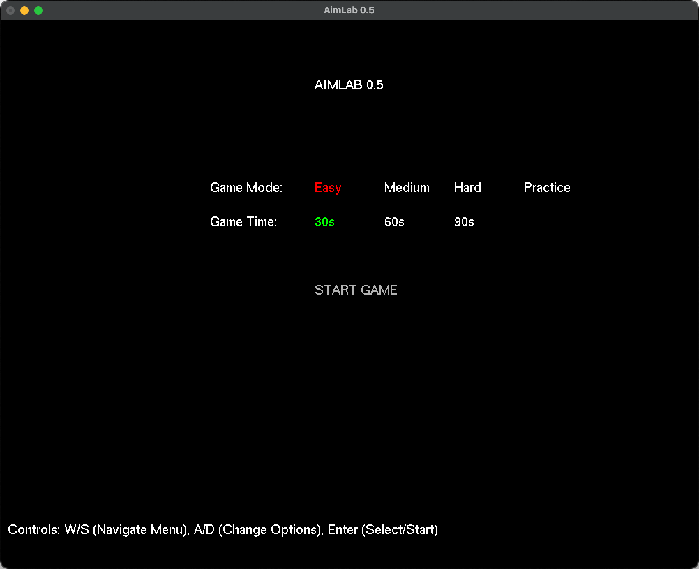
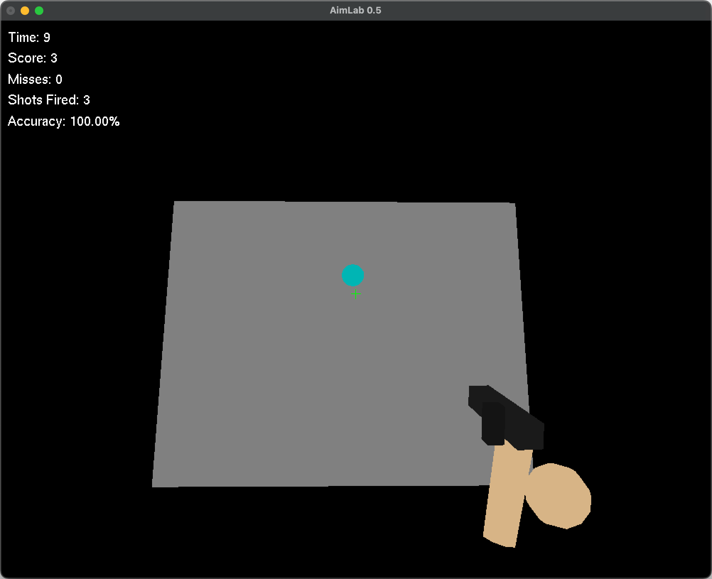
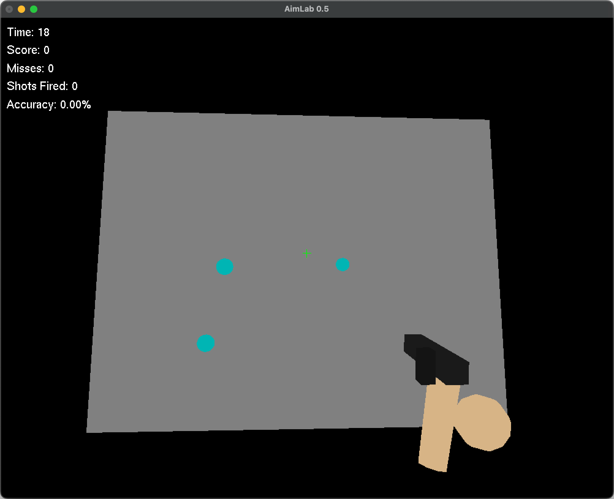
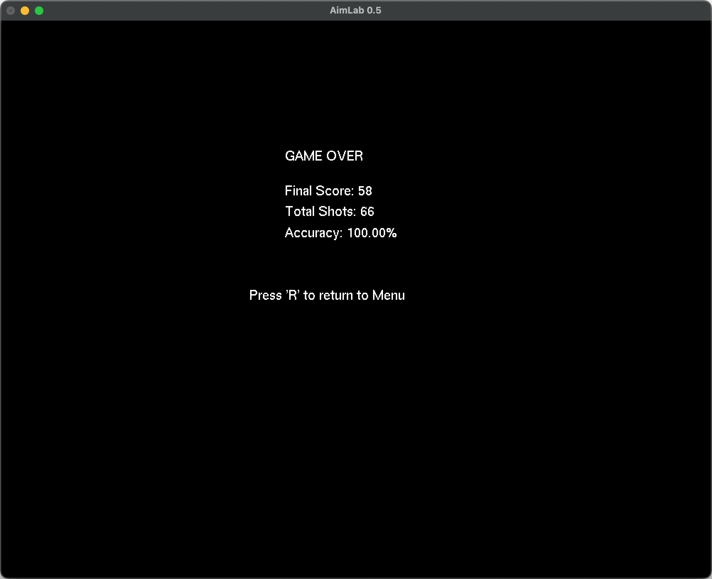

# AimLab 0.5

## Description

AimLab 0.5 is a simple 3D aim training game built with Python and PyOpenGL. It's designed to help players practice and improve their aiming skills in a first-person shooter (FPS) like environment. Players shoot at targets that appear on a distant wall, with different game modes offering varying levels of difficulty.

## Features

- **3D Environment:** Basic 3D world with a target wall.
- **Multiple Game Modes:** Choose from Easy, Medium, Hard, and a dedicated Practice mode.
- **Timed Challenges:** Test your skills against the clock in timed modes (30s, 60s, 90s).
- **Target Dynamics:**
    - **Easy:** Static targets.
    - **Medium:** Targets move and shrink over time. One target at a time.
    - **Hard:** Maintains 3 active targets. Targets move and shrink rapidly. When a target is destroyed or vanishes, a new one instantly appears.
    - **Practice:** Hit a set number of static targets at your own pace.
- **Scoring System:** Tracks score, misses, shots fired, and accuracy.
- **Player Controls:** Standard FPS-style mouse aiming and WASD movement.
- **Visual Feedback:** Bullet tracers and hit impact effects.
- **Interactive Menu:** Navigate and select game options using the keyboard.

## Game Modes

- **Easy:** Targets are static and appear one at a time. Good for beginners.
- **Medium:** Targets move horizontally and vertically, and shrink over time. Only one target appears at a time. If a target shrinks and vanishes, a new one spawns.
- **Hard:** Always maintains 3 active targets on screen. Targets move and shrink rapidly. When a target is destroyed by the player or vanishes due to shrinking, it is immediately replaced by a new one to keep the count at 3. This mode provides constant action.
- **Practice:** Focus on hitting a specific number of static targets (100 by default) without a time limit.

## Controls

### Menu Navigation
- **W / S:** Navigate up/down through menu options (Game Mode, Game Time, Start).
- **A / D:** Change selected option (e.g., cycle through Easy, Medium, Hard).
- **Enter:** Select current option or start the game/practice session.
- **Esc:** Exit the game.

### In-Game
- **Mouse Movement:** Aim your crosshair.
- **Left Mouse Click:** Shoot.
- **W / A / S / D:** Move the player forward, left, backward, and right respectively.
- **M:** Return to the main menu from an active game.
- **C:** Toggle Cheat Mode. When ON:
    - Displays "Cheat Mode: ON" on the UI.
    - Automatically aims at the nearest active target.
    - Automatically fires at the aimed target.
- **Esc:** Exit the game.

### Game Over Screen
- **R:** Return to the main menu.
- **Esc:** Exit the game.

## How to Run

1.  **Prerequisites:**
    *   Python 3.x
    *   PyOpenGL: `pip install PyOpenGL PyOpenGL_accelerate`
    *   GLUT: Installation varies by OS.
        *   **Windows:** Often included with graphics drivers or can be downloaded (e.g., `glut32.dll`).
        *   **Linux:** `sudo apt-get install freeglut3-dev` (or equivalent for your distribution).
        *   **macOS:** Usually comes pre-installed with Xcode command-line tools. If not, `brew install freeglut`.

2.  **Clone the repository (if applicable) or download `aimlab.py`.**

3.  **Navigate to the project directory in your terminal.**

4.  **Run the script:**
    ```bash
    python aimlab.py
    ```

## Screenshots

Below are some screenshots of AimLab 0.5 in action.

**Main Menu:**


**Gameplay - Easy Mode:**


**Gameplay - Hard Mode:**


**Game Over Screen:**



## Future Improvements (Ideas)

-   More varied target types (e.g., different sizes, health points, movement patterns).
-   Advanced scoring metrics (e.g., reaction time, precision).
-   Sound effects for shots, hits, and misses.
-   Customizable settings (e.g., sensitivity, crosshair).
-   Different training scenarios or maps.
-   Saving and loading player profiles/high scores.
